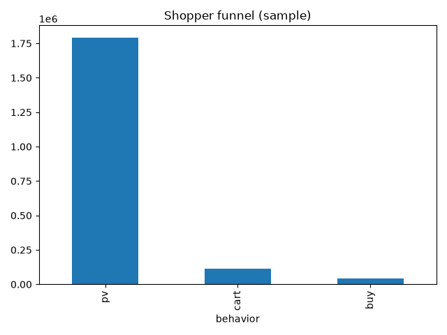
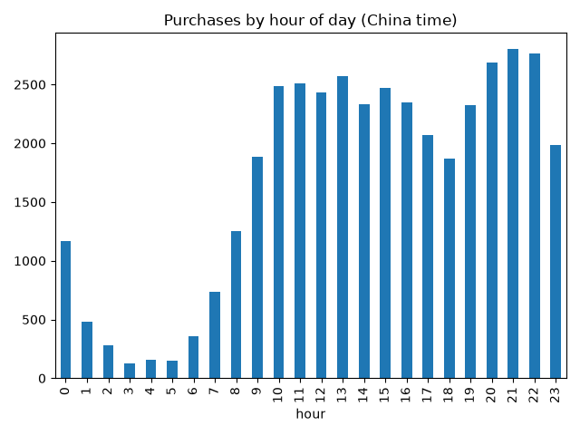

# data-analysis-project

## Project Question
Where do Taobao shoppers drop off between viewing a product and buying it, and what do buyers do differently?

## Data
Taobao User Behavior dataset (Kaggle / Alibaba Tianchi). I analyzed a sample of the first 2,000,000 rows. Columns: user_id, item_id, category_id, behavior (pv, cart, fav, buy), timestamp.

## Tools
Python, pandas, matplotlib

## Findings

### 1. Shoppers drop off most between viewing and adding to cart
In the sample, there were 1,791,216 product views, 111,015 cart adds (about 6.2% of views) and 40,243 purchases (about 2 purchases per 100 views).

### 2. Purchases peak in the evening
Purchases are highest between 20:00 and 22:00 (China time), stay steady from 10:00 to 16:00, and are lowest between 02:00 and 06:00. Evening promotions are likely to reach the most buyers.

## Limitations
This is a sample of the first 2 million rows, and the counts are actions, not unique users.
